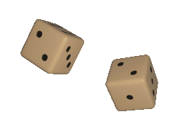

<head>

</head>
<body>

# Roll the Dice ! 

Presenting to you, Shayann &amp; Fiona's Hackathon Game! 

Win against the computer in a game of roll the dice as you climb up a set of ladders or side down the back of a googly eyed snake! 

## Instructions: 
On the CLI, you will receive a prompt to press enter to roll the dice.
Once you have your number, your position on the board will update accordingly. 

- If you're above the computer, your position will be highlighted in <g>green</g>. 
- If you're behind the computer, it will be <r>red</r>. 
- If you're on the same position, it will be <y>yellow</y>.

## How the game works: 
- Roll the Dice (between 1-6)
- Move to your new position 
- Now it's the computer's turn!
- Rinse and repeat till you or the computer reaches level 100!

Now, are you luckier than a computer?

